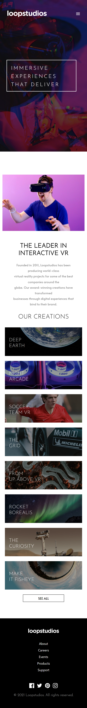

# Frontend Mentor - Loopstudios landing page solution

This is a solution to the [Loopstudios landing page challenge on Frontend Mentor](https://www.frontendmentor.io/challenges/loopstudios-landing-page-N88J5Onjw). Frontend Mentor challenges help you improve your coding skills by building realistic projects. 

## Table of contents

- [Overview](#overview)
  - [The challenge](#the-challenge)
  - [Screenshot](#screenshot)
  - [Links](#links)
- [My process](#my-process)
  - [Built with](#built-with)
  - [Continued development](#continued-development)
- [Author](#author)

## Overview

### The challenge

Users should be able to:

- View the optimal layout for the site depending on their device's screen size
- See hover states for all interactive elements on the page

### Screenshot

### Links

- Solution URL: [Add solution URL here](https://your-solution-url.com)
- Live Site URL: [LoopStudio](https://adelakunloopstudio.netlify.app/)

## My process

### Built with

- Semantic HTML5 markup
- CSS custom properties
- Flexbox
- CSS Grid
- Mobile-first workflow
- Javascript

### Continued development

I intend to keep practicing Javascript functions.

## Author

- LinkedIn - [Adelakun Abayomi](https://www.linkedin.com/in/abayomi-adelakun-897227178/)
- Portfolio - [Adelakun Abayomi](https://adelakunportfolio.netlify.app/)
- Frontend Mentor - [@thisisadelakun](https://www.frontendmentor.io/profile/thisisadelakun)
- Twitter - [@thisisadelakun](https://www.twitter.com/thisisadelakun)

